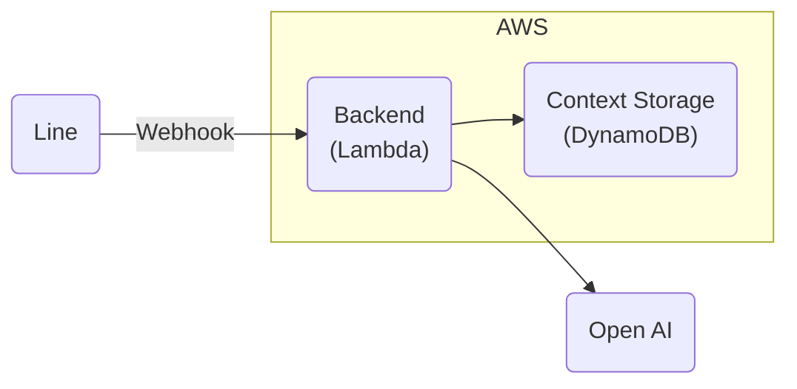

# Buddy

OpenAI-based LINE bot with memory (experimental)




## Build and deploy

### Setup

``` sh
cargo install cargo-lambda
```

### Build

``` sh
cargo lambda build --release
```

### Deploy

``` sh
cargo lambda deploy --iam-role <lambda execution role>
```
